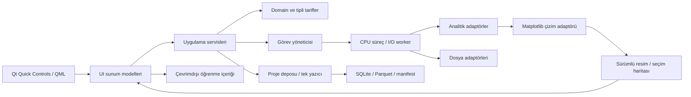

# Veri_Ufku — mimari

Durum: Faz00 tasarımı + Faz01 görev iskeleti + Faz02 kabuk + Faz03 çevrimdışı öğrenme. [Kurallar](PROJECT_RULES.md), [tasarım brief'i](UI_DESIGN_BRIEF.md), [UX](UX.md), [sözleşmeler](CORE_CONTRACTS.md), [teknik ortam](ENVIRONMENT.md).

## Sınırlar ve bağımlılık yönü

Planlanan paket `src/veri_ufku/`: ui (QML ve sunum), domain (Qt'siz tipler), services (kullanım senaryoları), analytics (Polars/DuckDB/SciPy/sklearn adaptörleri), importers (format parse), storage (tek yayın protokolü), jobs (iş/iptal/IPC), charts (ChartSpec→render/export), learning (sürümlü içerik). Framework eklenmez; bu dizinler Faz 01 ve ilgili fazlarda oluşur. Qt nesnesi analitik çekirdeğe girmez. Domain veri depolama nesneleri ve DataFrame taşımaz; immutable tanımlar ve artefact referansları kullanır.

QML TableView + QAbstractTableModel ile sınırlı sayfa cache'i; `data()` I/O yapmaz, hazır hücreye erişir. Sayfa worker ile gelir, ana thread model sinyali verir. Sıralama/filtre tüm dataset planında yapılır; yalnız görünür sayfayı sıralayıp bütün veri gibi sunmaz. RowId seçimi sayfa dışında korunur. Kolon ve satır başına kalıcı widget yok.

## Veri ve iş yaşam döngüsü

Servis import ayarlarını, sabit kaynağı, ColumnId'leri ve config_revision'ı bağlar. Job girdileri bir kez sabitlenir. Worker snapshot referansı ve tipli JSON tarif alır; UI objesi almaz. CPU işleri `spawn` tabanlı ayrı süreç, hafif dosya I/O Qt bağımsız cooperative thread worker; Qt/Matplotlib nesnesi süreçler arası geçirilmez. Küçük render ayrı worker/süreçte Agg; GUI QImage bridge'i ana thread üzerinden günceller.

İlerleme ölçülemiyorsa aşama/belirsiz ilerleme, biliniyorsa done/total; uydurma yüzde yok. İptal tokenı chunk sınırında kontrol edilir. Süreç iptali grace sonrası sonlandırılabilir; hiçbir worker aktif manifest değiştiremez. Sonuç job_id + dataset_version + config_revision + result_version ile gelir. Eşleşmeyen sonuç eski sonuçlar alanında kalır; güncel paneli değiştirmez. Kapanış yeni görev alımını keser, iptal/cleanup yapar, tek yazıcı kilidini en son bırakır.

## Analitik ve çizim

Polars genel tablo motoru; disk/spill veya yerel SQL gerektiğinde DuckDB. Motor seçimi CORE_CONTRACTS semantiğini değiştiremez. NumPy/model dense dönüşümü maliyet ve hassasiyet önkontrolüyle. SciPy istatistik, scikit-learn fold-içi Pipeline, statsmodels yalnız ihtiyaç duyulan yöntemlerde optional adapter.

Matplotlib Agg→RGBA/PNG ve SVG export, Qt Quick QImage/image provider bağlantısı (ADR-002). Etkileşim olayları UI koordinatından domain SelectionSpec'e dönüşür; render worker GUI'yi değiştirmez. ChartSpec görsel ayarları taşır; AnalysisResult sayısal hesabı taşır. Grafik üzerinde değişen başlık/renk veri sürümü yaratmaz; filtre/agregasyon yeni sonuç config'i yaratır. Gerçek QML etkileşimi ve paket export Faz 12'de doğrulanacaktır.

## Proje, içerik ve çevrimdışı kullanım

ADR-003 tek yayınlama ve kilit protokolü zorunlu. Proje dizini: metadata.sqlite, değişmez commits/<commit_id>/manifest.json, snapshots/<artifact_id>.parquet, lineage/, recipes/, results/, models/ ve staging/. `ACTIVE` tek otoritatif commit işaretçisidir; aktif SQLite görünümü commit kimliği üzerinden okunur. Kaynaklar isteğe bağlı sources/ içine kopyalanır. SQLite aktif sürümünü bağımsız güncellemez.

ProjectManifest relatif artefact URI + hash kullanır. Dış kaynak yolu ipucu olabilir, veri bütünlüğü kanıtı olamaz. Taşıma yeni dizinde hash doğrulamasıyla; source kayıpsa proje snapshot'ı açılır, yeniden import için eşleme gerekir. Export projenin kopya/secret/kişisel veri içeriğini açık gösterir. Arşiv açılırken traversal/symlink/zip boyutu sınırları uygulanır.

LearningArticle paket içinde Markdown/JSON, article_id/content_version/locale/capability_id; ağ isteği yok. Temel yardımın hangi sürümü kullanıldığı sonuçta saklanır. Uyumsuz yardım eski yöntemin davranışını güncelmiş gibi açıklamaz. Örnekler kendi sandbox projelerinde; yardım kapatılınca servis/job durumları değişmez. Yerel font ve rapor kaynakları paketlenecek, ilk açılış gizli download yok.

## Hata ve güvenlik sınırları

AppError: code, sade mesaj, önerilen düzeltme, correlation_id ve hassas veri içermeyen teknik ayrıntı. Parse, kaynak değişimi, izin, disk, bellek, unsupported dtype/version, lock, canceled ve stale ayrı kodlar. Dosya/formül eval/exec yok; güvenli AST izin listesi gelecekte işlem motorunda. SQL değerleri parametreli, tanımlayıcılar kayıtlı ColumnId haritasından doğrulanmış/quote edilmiş. Dış pickle/joblib çalıştırılmaz; güvenli model formatı Faz 20 destek matrisinde seçilir. Süreç izolasyonu güvenlik sandbox'ı değildir.

## Test sorumlulukları

Domain/hesap tests Qt'siz; importer elle yazılmış fixture; depo fault injection + iki süreç; jobs stale/config/iptal; QML başsız model ve signal smoke; gerçek Wayland/X11 keyboard/DPI akışı; bağımsız kullanıcı testi. Erken paket import Faz 06 ve grafik/export/process Faz 12; bütün paket sorunları Faz 27'ye bırakılmaz. [DEVELOPMENT](DEVELOPMENT.md), [ACCEPTANCE_POLICY](ACCEPTANCE_POLICY.md).

## Faz 01 uygulanan sınır

UI/controller, domain/contracts/capabilities, services/demo, jobs/manager/workers, storage/workspace ve learning/i18n gerçek uygulamadır. Import/proje depolama/analitik/öğrenme içerikleri bu fazda mevcut değildir. Görev geçici alanı proje yayınlama protokolü yerine geçmez. Uygulama yapılandırması ve güvenli log tek giriş noktasından kurulur. [Runtime ve worker kararı](adr/005-runtime-jobs-lock.md), [kanıt](evidence/PHASE01.md).

## Faz02 sunum sınırı

UI tercihleri PresentationPreferences QObject’unda; tema/görünüm/yazı boyutu ayrı atomik ui-preferences.json içindedir. Mod/tema değişimi DemoSession Binding veya JobSpec’i değiştirmez. Theme.qml tek token kaynağı, Main.qml tek pencere kabuğu, ortak bileşenler UiButton/UiCombo/StateNotice/InfoPanel. Henüz dataset olmadığı için üst bağlam bunu açık söyler; gelecek navigasyon yalnız kullanılabilirlik ekranıdır. Faz02 dönemindeki panel açıklaması yalnız kabuk yardımıydı; Faz03 ortak katalog render'ına taşındı. [Faz02 kanıtı](evidence/PHASE02.md).

## Faz03 öğrenme sınırı

Learning Catalog paket JSON şema1 ve düz metin bloklarını Qt/analitik kodundan bağımsız doğrular. LearningController arama, kategori, sözlük, makale/derinlik state'i ve isteğe bağlı atomik okuma işaretlerini QML'ye aktarır. InfoPanel/ArticleView aynı katalogdan okur. Ayrı ExampleWindow ve bağımsız LearningController yalnız geçici örnek öğrenme projesini açar; gerçek proje deposu veya analitik yetenek oluşturmaz. Capability help_links ve QML helpContext bağları CI'da zorunlu doğrulanır. [İçerik sözleşmesi](LEARNING_CONTENT.md).
