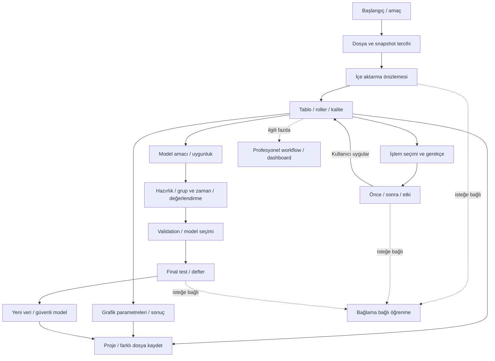

# Veri_Ufku — ekran haritası ve kullanım akışı

Faz00 ekran planı; Faz02 gerçek kabuk ve Faz03 öğrenme akışı aşağıda kayıtlı. Veri/analiz akışları ilgili fazlara ait planlardır. [Ürün senaryoları](PRODUCT.md), [brief](UI_DESIGN_BRIEF.md), [sistem](DESIGN_SYSTEM.md), [referanslar](UI_REFERENCES.md), [üç prototip](prototypes/triptych.svg).

Gri/gelecek dal gerçek uygulamada henüz nav'a eklenmez. Diagram Faz00 planıdır; eğitim veya tahmin çalıştığı iddiası yok.

## Ekran sorumlulukları

| ID / ekran / faz | Kullanıcının sorusu ve ana eylem | Görünür bağlam / hata / geri dönüş |
|---|---|---|
| SCR-01 Başlangıç/amaç, 02 | “Ne yapmak istiyorsunuz?” amaç kartları, Dosya aç | Son projeler yerel, örnekler; olmayan amaç yolu etiketli veya gizli; seçimi dosya/proje durumunu silmez |
| SCR-02 Import preview, 05–06 | “Dosya doğru okunuyor mu?” ayarları kontrol et→İçe aktar | 200 kayıt sınırlı örnek, delimiter/encoding/date/decimal/null, role, snapshot zamanı, kopya+disk tercihi; kaynak değişiminde tekrar preview; hata/karantina kararı |
| SCR-03 Tablo/kalite, 07–08 | “Verim ne içeriyor?” sütun seç→incele | version/filter/full-sample badge, profile/quality/gerekçe, column_id rol; bozuk kayıtları saklama raporu; salt okunur; undo geçmişi |
| SCR-04 Önce/sonra, 09–11 | “Neyi değiştirecek?” seç→önizle→Uygula | aynı RowId, changed/dropped/new null, olası precision loss, maliyet; iptal hiçbir sürümü publish etmez |
| SCR-05 Grafik, 12 | “Nasıl görünür?” grafik seç→Oluştur | axes/unit/bins/filter/scope/version, downsample/Diğer sayısı; zoom/reset/select; PNG/SVG; görünüş ayarı analitik state'i değiştirmez |
| SCR-06 Analiz/model, 14–20 | “Hangi soru/yöntem, sonuç ne anlatıyor?” uygunluk→Çalıştır | params/result/diagnostics, n/exclusions/assumptions, model split/test ledger; destek yoksa ret; geniş seçenekler uzman panelinde |
| SCR-07 Öğren, 03+ | “Bu ne işe yarar?” Özet/örnek/uygun değil/yorum | panel isteğe bağlı, close işe dokunmaz; örnek sandbox, içerik sürümü; yöntem yoksa yardım çalışıyormuş göstermez |
| SCR-08 Workflow/dashboard, 39/64 | “İşlem ve görünümü nasıl düzenlerim?” profesyonel typed DAG/layout | mevcut service/spec/version yeniden kullanır; başlanmadı; erken boş düğme yok |

## Üç yolun state ve geri dönüşleri

US-01 (PRODUCT): SCR01→02→03→05→save; kullanıcı çizmeden sadece tabloda/profilde kalabilir. Preview “Geri” import ayarlarını saklar; dosya değiştirme yeni snapshot/ayar doğrulaması ister. Import başarısı publication sonrası; job cancel son sağlam projeyi korur.

US-02: SCR01→02→03→04→03→save. Öneri metni gerekçe ve etkiyi söyler. Preview cancel aktif veriye dokunmaz. Uygulama hata verirse aynı tarifi düzeltmeye dönülür; undo eski sürüme, history eski dalı korur. Genel learned doldurma model risk bayrağıyla kayıtlıdır.

US-03: SCR01→02→03→06(uygunluk/hazırlık/split)→validation→final test→yeni dosya eşleme→save. Tahmin anındaki bilgi/hedef ufku/grup kullanım amacı sorulmadan uygun split tamamlandı sayılmaz. Final test açık eylem ve defter; geçersiz plan işi durdurur. Model bulunamadığında fake metric/chart yok.

Başlangıç→uzman yalnız visibility/layout tercihidir. Ortak project/session config_revision ve dataset_version aynı; parametre editleri job başladığında sabitlenir. Geçiş scroll/selection/draft/result_ref'i korur. Öğren paneli ayrı presentation state. Navigasyon dirty parametreyi kaybetmez, veri kaybı riski varsa anlaşılır karar gerekir.

## Temsilî tasarım kapısı

Dosya preview, tablo kalite ve analiz sonucu aynı tokenlarla tasarlandı: [SVG](prototypes/triptych.svg), [inceleme](DESIGN_REVIEW.md). Sonuç alanı hesaplanmış sayı içermez, açık “prototip / gerçek sonuç yok”. Faz02 bu taslakları gerçek tema/Qt ölçeğiyle yeniden değerlendirir; sorun kapatmadan diğer ekranlara yayılmaz. Statik prototip gerçek import/model kabulü değildir.

## Faz02 çalışan kabuk

Sekiz nav alanı yerleşimi gerçek Qt’de uygulanır; gelecek alanların merkezinde “Henüz mevcut değil” ve amaç açıklaması vardır. Başlangıçta veri açma/örnek kartları görünür fakat import hazır olmadığı için devre dışıdır; kısa amaç kartları aynı kullanılabilirlik ekranını açar. UI dosyaya dokunmaz.

Başlangıç/gelişmiş tercihi sunum state’idir: sonuç/hata/iptal iki görünümde ortak, teknik kimlik/config denemeleri yalnız gelişmişte. Tema/görünüm/yazı tercihi yeniden açılışta geri gelir. Sağ panel genişte dock, darda modal Drawer; Escape/kapama odağı açana döndürür. Nav Ctrl+1..8/oklar/Space, genel Tab/ShiftTab; uzun içerik klavye odağına kaydırılır. [Gerçek ekran/Qt kanıtı](evidence/PHASE02.md).

## Faz03 gerçek öğrenme akışı

Öğren ekranı çevrimdışı Türkçe arama, kategori ve dokuz kavramlık sözlük sunar. Makale seçimi sağ bilgi panelini açar; özet/örnek/rehber seçimi aynı makaleyi okutur. Kritik uyarı her derinlikte ve gelişmiş görünümde katlanmadan kalır. Panel kapanması mevcut işi/sonucu/aramayı değiştirmez. İsteğe bağlı okundu/yer imi kaydı varsayılan kapalı ve yalnız açık kullanıcı eylemiyle yereldir. Uygulamada dene yalnız yardım araması için bağımsız geçici örnek öğrenme projesini açar; veri/model denemesi sunmaz. [Sözleşme](LEARNING_CONTENT.md).

## Faz04 gerçek proje akışı

Başlangıçtaki Projen kartı Yeni proje/Proje aç/Kaydet/Farklı kaydet/Projeyi kapat ve son projeleri sunar. Yeni hedef mevcut olmayan dizindir; mevcut hedefler korunur. Proje adı, isteğe bağlı seed, kaynak referansı/taşınabilir kopya açıklaması, dosya seçimi ve yeniden bağlama aynı karttadır. Kaynak durumu ile sonuçların veri sürümü görünürdür. Metadata açılışı yeniden işlem yapmaz. Kapanış dirty kararını açık sorar; otomatik kurtarma kaydını yükleme ekrandaki draft yerine geçmeden karar ister. I/O sürerken kayıt kontrolleri ve kapanış bekler, Qt olayları devam eder. İkinci örnek salt okunur, eski kilit kurtarma açık eylemdir. F1 proje/kaynak/kurtarma rehberini açar. [Kanıt](evidence/PHASE04.md).

## Faz05 uygulama bağı

Faz05 Veri ekranında Dosya seç/yerel tek dosya DropArea, algılama önerisi ve düzenlenebilir bütün import ayarları vardır. Önizleme200 kayıtla sınırlı sanal tablo; sütun türünü kullanıcı seçer. Bozuk kayıt Durdur/Raporlu karantina; kaynak kopyası zamanı/SHA256 ve güncel kaynak için yeniden seçim açıklaması açık. İçe aktar ve projeye kaydet draft değişikliklerini de kaydeder; tamamlanma sonrası dataset sürümü/kayıt ve karantina sayısı görünür. İptal ve aktif görevde proje geçişi engeli vardır. Dar/%200 ekranda tek sütun/sarılan düğmeler; tablo yatay/dikey kayar. [Kanıt](evidence/PHASE05.md).

## Faz06 import

Veri ekranı tüm altı adaptörü alır; format elle düzeltilebilir. JSON path/flatten ve liste açma ayrı; kartesyen büyüme önizlemede. Excel sayfa/aralık/başlık ve merged/blank/formula/date politikası görünür. Parquet tür değiştirme kapalı, native types öneri yanında görünür. Aynı kopyayı önizle; türleri sıfırla; iptal ve projeye kaydet ortak. [Kanıt](evidence/PHASE06.md#e06-gui).

## Faz07 katkısı

Faz07: Veri → Veri tablosu → Tabloyu aç/yenile. Sütun arama/gizle/seç; global sıralama ve en fazla8 AND filtre. Salt okunur, aktif filtre/kapsam ve200 kayıt sayfa görünür. Sütun detayında rol/birim/ordinal sıra/analiz birimi taslağa uygulanır; Projeyi kaydet kalıcıdır. Profil hedefi ve first10.000/tam seçimi açıktır; görünüm filtresi dataset’i değiştirmez. [Kanıt](evidence/PHASE07.md).

## Faz08 katkısı

Veri → Veri kalitesi → dataset/miktar/kapsam/amaç → isteğe bağlı seçili tekrar anahtarı ve kurallar → Kaliteyi tara. Bulgu gerekçesi, sayım/oran, örnek, seçenek ve yardım aynı kartta; aday/gözlem/ihlal metinle ayrılır. Raporu proje taslağına ekle → Projeyi kaydet; yeniden açıldığında aynı sürümün raporu görünür. [Karar](adr/011-quality-phase08.md), [kanıt](evidence/PHASE08.md).

## Faz09 gerçek işlem akışı

Hazırla → dataset/rename/drop/filter → Önizle → tam veri etki sayısı, önce/sonra şema ve first200 tablo → Uygula ve projeye kaydet. Kalıcı filtre koşulları Veri tablosunda hazırlanır; görünüm sıralaması kalıcı filtre hesabına karışmaz. Geçmişte Geri al/Yinele veya adımın öncesine dön; yeni işlem eski dalı korur, redo zinciri temizlenir. Sonuçların veri sürümü ve “güncel değil” etiketi aynı ekrandadır. Kaynak farkı/önizleme/geçmiş yardımı bağlamlıdır. [Karar](adr/012-versioned-operations-phase09.md).
